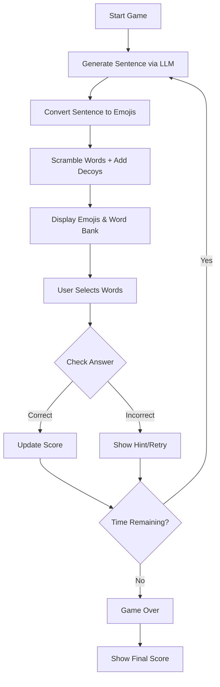
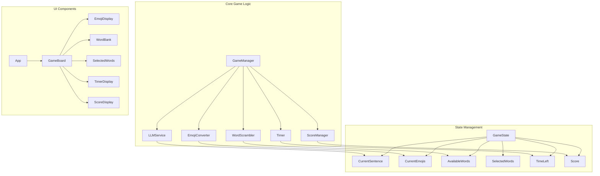

# Emoji Word Game Architecture

## Game Flow Diagram

## Code Structure

## Component Responsibilities

### GameManager
- Orchestrates game flow
- Manages game state transitions
- Coordinates between services

### LLMService
- Generates sentences based on categories
- Converts sentences to emoji representations

### EmojiConverter
- Handles emoji mapping logic
- Validates emoji representations

### WordScrambler
- Breaks sentences into words
- Adds decoy words
- Randomizes word order

### Timer
- Manages countdown
- Handles time-based events

### ScoreManager
- Tracks correct answers
- Calculates score based on time/accuracy

### UI Components
- EmojiDisplay: Shows emoji puzzle
- WordBank: Displays available words
- SelectedWords: Shows user's current selection
- TimerDisplay: Shows remaining time
- ScoreDisplay: Shows current score