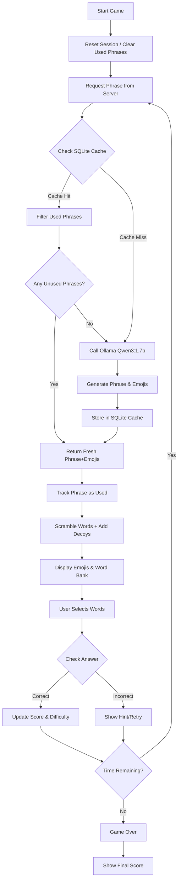
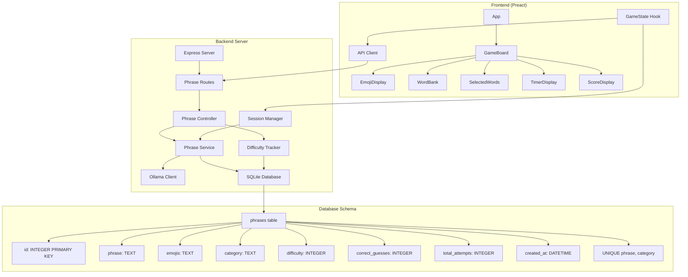

# Emoji Word Game Architecture

## Game Flow Diagram

## Code Structure

## Component Responsibilities

### Frontend Components
- **App**: Main application router
- **GameBoard**: Game interface container
- **EmojiDisplay**: Shows emoji puzzle
- **WordBank**: Displays available words
- **SelectedWords**: Shows user's current selection
- **TimerDisplay**: Shows remaining time
- **ScoreDisplay**: Shows current score
- **GameState Hook**: Manages game state and API calls
- **API Client**: Communicates with backend server

### Backend Components
- **Express Server**: HTTP server setup
- **Phrase Routes**: API endpoint definitions
- **Phrase Controller**: Request/response handling
- **Phrase Service**: Business logic for phrase generation
- **Ollama Client**: Integration with local Ollama server
- **SQLite Database**: Persistent phrase caching
- **Difficulty Tracker**: Updates difficulty based on player performance
- **Session Manager**: Tracks used phrases per game session

### Database Schema
- **phrases table**: Cached phrases with metadata
  - `id`: Primary key
  - `phrase`: The original sentence
  - `emojis`: Emoji representation
  - `category`: Phrase category (movies, idioms, songs)
  - `difficulty`: Calculated difficulty (1-10)
  - `correct_guesses`: Number of successful guesses
  - `total_attempts`: Total number of attempts
  - `created_at`: Timestamp of creation

## API Endpoints

### GET /api/phrases/random
- **Purpose**: Get a random phrase with emojis (ensures fresh phrases per session)
- **Query Params**: `category` (optional)
- **Response**: `{ id: number, phrase: string, emojis: string, category: string }`

### POST /api/phrases/guess-result
- **Purpose**: Update difficulty tracking
- **Body**: `{ phraseId: number, wasCorrect: boolean }`
- **Response**: `{ success: boolean }`

### GET /api/categories
- **Purpose**: Get available categories
- **Response**: `string[]`

### POST /api/session/reset
- **Purpose**: Reset used phrase tracking for new game session
- **Response**: `{ success: boolean, message: string }`

### UI Components
- EmojiDisplay: Shows emoji puzzle
- WordBank: Displays available words
- SelectedWords: Shows user's current selection
- TimerDisplay: Shows remaining time
- ScoreDisplay: Shows current score