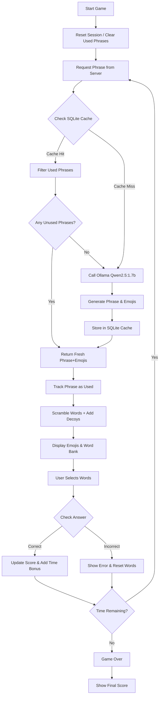
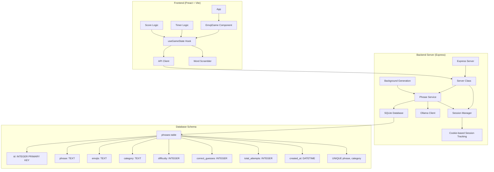

# Emoji Word Game Architecture

## Game Flow Diagram



## Code Structure



## Component Responsibilities

### Frontend Components (Preact + Vite)
- **App**: Main application router and entry point
- **EmojiGame**: Main game component with UI layout
- **useGameState Hook**: Central state management for game logic
- **API Client**: HTTP communication with backend server
- **Word Scrambler**: Scrambles phrases and validates answers
- **Timer Logic**: Countdown timer with time extension on correct answers
- **Score Logic**: Score calculation with time and word bonuses

### Backend Components (Node.js + Express)
- **Server Class**: Main server setup with graceful shutdown
- **Phrase Service**: Core business logic for phrase management
- **Session Manager**: Cookie-based session tracking for phrase uniqueness
- **Ollama Client**: Integration with local Ollama server using qwen2.5:1.7b
- **SQLite Database**: Persistent phrase caching with automatic cleanup
- **Background Generation**: Automatic phrase population when cache is low
- **Database**: SQLite wrapper with phrase operations

### Database Schema
- **phrases table**: Cached phrases with metadata
  - `id`: Primary key
  - `phrase`: The original sentence
  - `emojis`: Emoji representation
  - `category`: Phrase category (movies, idioms, songs)
  - `difficulty`: Calculated difficulty (1-10)
  - `correct_guesses`: Number of successful guesses
  - `total_attempts`: Total number of attempts
  - `created_at`: Timestamp of creation
  - `UNIQUE(phrase, category)`: Ensures phrase uniqueness per category

## API Endpoints

### GET /api/phrases/random
- **Purpose**: Get a random phrase with emojis (ensures fresh phrases per session)
- **Query Params**: `category` (optional)
- **Response**: `{ id: number, phrase: string, emojis: string, category: string }`
- **Session Management**: Uses cookie-based session tracking to prevent phrase repetition

### POST /api/phrases/guess-result
- **Purpose**: Update difficulty tracking and performance metrics
- **Body**: `{ phraseId: number, wasCorrect: boolean }`
- **Response**: `{ success: boolean }`

### GET /api/categories
- **Purpose**: Get available categories
- **Response**: `string[]`

### POST /api/session/reset
- **Purpose**: Reset used phrase tracking for new game session
- **Response**: `{ success: boolean, message: string }`

### GET /api/health
- **Purpose**: Health check endpoint
- **Response**: `{ status: 'OK', timestamp: string }`

## Testing Architecture

### Frontend Tests
- **Jest + Testing Library**: Component testing
- **Header Tests**: Basic component rendering tests
- **Mock Setup**: Browser and file mocks for testing environment

### Backend Tests
- **Integration Tests**: Full server flow testing
- **Ollama Tests**: AI integration testing
- **Session Tests**: Multi-session uniqueness testing
- **Performance Tests**: Timer extension and phrase availability testing
- **Generation Tests**: Phrase generation and caching tests

## Development Tools

- **Vite**: Frontend build tool and dev server
- **Concurrently**: Run frontend and backend simultaneously
- **Jest**: Testing framework
- **ESLint**: Code linting with Preact configuration
- **SQLite3**: Database for phrase caching

## Project Structure

```
wordgames/
├── src/                          # Frontend source code
│   ├── components/               # Preact components
│   │   ├── app.jsx              # Main app component
│   │   ├── EmojiGame.jsx        # Main game component
│   │   ├── emoji-game.css       # Game styles
│   │   └── header/              # Header component
│   ├── hooks/                   # Custom React hooks
│   │   └── useGameState.js      # Main game state management
│   ├── services/                # Frontend services
│   │   ├── apiClient.js         # API communication
│   │   ├── wordScrambler.js     # Word scrambling logic
│   │   └── test-validation.js   # Test utilities
│   ├── routes/                  # Application routes
│   │   └── profile/             # Profile route (placeholder)
│   ├── assets/                  # Static assets
│   ├── style/                   # Global styles
│   ├── index.jsx                # Application entry point
│   ├── sw.jsx                   # Service worker
│   └── manifest.json            # PWA manifest
├── server/                      # Backend server code
│   ├── server.js                # Main server class
│   ├── phraseService.js         # Phrase generation service
│   ├── sessionManager.js        # Session management
│   ├── ollamaClient.js          # Ollama AI integration
│   ├── database.js              # SQLite database wrapper
│   ├── cleanup-database.js      # Database maintenance
│   ├── check-phrases.js         # Phrase validation
│   └── phrases.db               # SQLite database file
├── tests/                       # Test files
│   ├── server/                  # Backend integration tests
│   │   ├── test-full-flow.js    # Complete flow test
│   │   ├── test-ollama.js       # Ollama integration test
│   │   ├── test-unique-phrases.js # Phrase uniqueness test
│   │   ├── test-multi-session-unique.js # Multi-session test
│   │   ├── test-phrase-generation.js # Generation tests
│   │   ├── test-empty-cache-generation.js # Cache tests
│   │   ├── test-direct-generation.js # Direct generation test
│   │   ├── test-timer-extension.js # Timer logic test
│   │   ├── test-simple-availability.js # Availability test
│   │   ├── test-phrase-availability.js # Phrase availability
│   │   ├── test-complete-game.js # Complete game flow
│   │   ├── test-multi-user.js   # Multi-user scenario
│   │   ├── test-repeat-prevention.js # Repeat prevention
│   │   └── test-fresh-phrases.js # Fresh phrase testing
│   ├── __mocks__/               # Test mocks
│   └── header.test.js           # Frontend component test
├── package.json                 # Project dependencies
├── architecture.md              # Architecture documentation
└── README.md                    # Project documentation
```